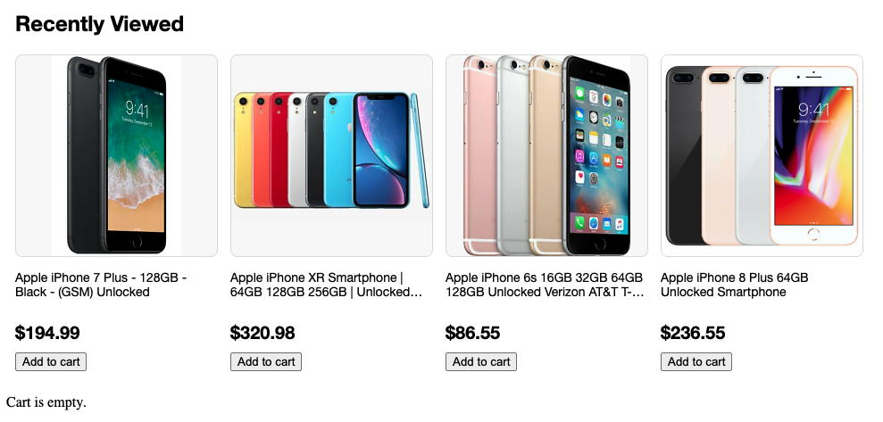

# This is a take home exercise for search FE position candidate

# Requirements:
 - Build a web page with a UI component to show recently reviewed items (4), each item has an image, title, price and add to cart button. UI mock as below:
 - Add click event handler for 'Add to cart' buttons. When user clicks any one of these buttons, update the text of 'Cart is empty.' to 'Item x added in cart.' 
 - [start file](index.html) is provided, add more file as needed. Please use the spcecs and raw data as below to build the UI.
 
 
  

 
 ## Specs and raw data:
  ```
    Component title: font-size 24px, bolded
    
    Images:
        horizontally and vertically center aligned within a 225px square box, 
        background color: #f8f8f8, border radius: 8px; border: 1px solid #ddd
        source:
        https://i.ebayimg.com/thumbs/images/g/peQAAOSwJK9bh~Tm/s-l225.png,
        https://i.ebayimg.com/thumbs/images/g/2ZUAAOSw4pJd2XZh/s-l225.png,
        https://i.ebayimg.com/thumbs/images/g/ZcwAAOSw44peap3s/s-l225.png,
        https://i.ebayimg.com/thumbs/images/g/RHIAAOSwCtJaGbNC/s-l225.png

    Item title:
        font-size: 16px
        only display maximum two lines, if overflow use ... as shown in the item 2 and item 3 from the above UI mock
        text:
        Apple  iPhone 7 Plus - 128GB - Black - (GSM) Unlocked,
        Apple iPhone XR Smartphone | 64GB 128GB 256GB | Unlocked Verizon AT&T T-Mobile,
        Apple iPhone 6s 16GB 32GB 64GB 128GB Unlocked Verizon AT&T T-Mobile Smartphone,
        Apple iPhone 8 Plus 64GB Unlocked Smartphone

    Price: font-size: 20px, bolded
